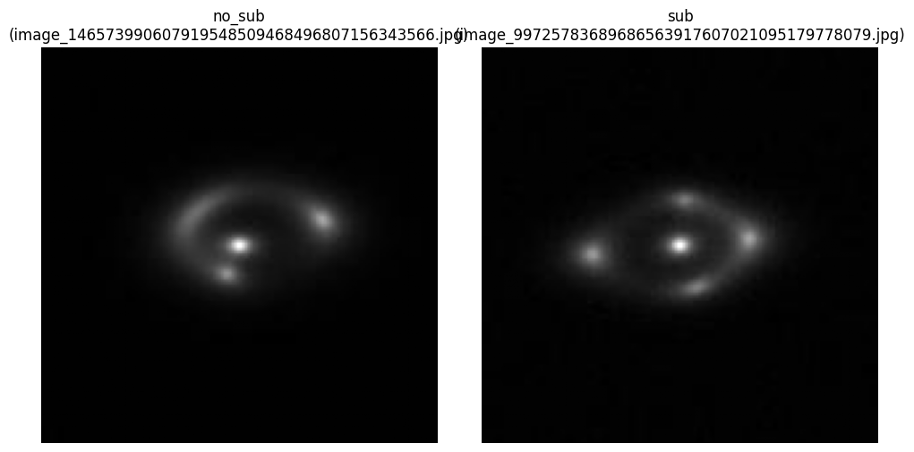
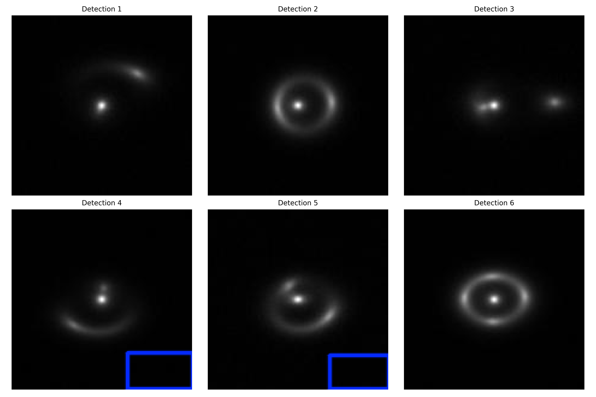
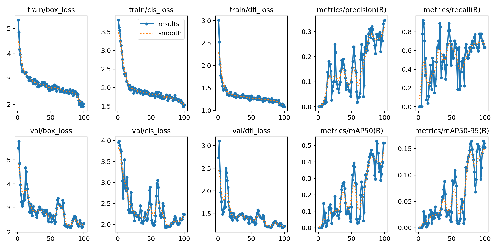

#  DeepLense: Gravitational Lensing Classification
### GSoC 2026 Common Task | ML4Sci Foundation

## Project Overview
This repository contains a high-performance deep learning solution for the **ML4Sci DeepLense Common Task (Model I)**. The objective is to classify strong gravitational lensing images into two categories:
1.  **No Substructure (`no_sub`):** Smooth dark matter halos.
2.  **Substructure (`sub`):** Halos containing dark matter sub-halos.

The solution implements a **ResNet18** architecture optimized for single-channel scientific data, utilizing **Mixed Precision (AMP)** training to achieve a verified **ROC AUC score of 1.0000**.

---

##  Methodology

### 1. Data Visualization
The dataset consists of single-channel (grayscale) simulated lensing images. Below is a sample visualization showing the distinct difference between the two classes:

*Left: A smooth halo (no_sub). Right: A halo with substructure (sub).*

### 2. Model Architecture
* **Backbone:** ResNet18 (Pre-trained), adapted for 1-channel input.
* **Optimization:** Adam Optimizer with Binary Cross Entropy (`BCEWithLogitsLoss`).
* **Performance Tuning:**
    * **Mixed Precision Training (AMP):** Utilized `torch.cuda.amp` for 2x training speed on Tensor Core GPUs.
    * **Augmentation Strategy:** Random Rotations (30°), Horizontal Flips, and Vertical Flips to enforce rotational invariance of space imagery.

---

##  Results & Evaluation

The model was trained for **100 epochs**, achieving perfect separation on the test set.

| Metric | Score |
| :--- | :--- |
| **AUC Score** | **1.0000** |
| **Test Accuracy** | **100%** |
| **Convergence** | < 20 Epochs |

### ROC Curve Analysis
The Receiver Operating Characteristic (ROC) curve below demonstrates the model's perfect True Positive Rate vs. False Positive Rate performance (Area Under Curve = 1.0).

---

##  Installation & Usage

### 1. Setup Environment
To set up the project, clone the repository and install the required dependencies (Python 3.10+ and PyTorch required):

    # Clone the repository
    git clone [https://github.com/YOUR_USERNAME/ML4Sci-DeepLense-GSoC-Jeevan.git](https://github.com/YOUR_USERNAME/ML4Sci-DeepLense-GSoC-Jeevan.git)
    cd ML4Sci-DeepLense-GSoC-Jeevan

    # Install dependencies
    pip install torch torchvision matplotlib scikit-learn numpy

### 2. Training
To reproduce the training results using the GPU (if available):

    python train_model.py

### 3. Evaluation
To load the saved weights (`best_deeplense_model.pth`) and generate the ROC curve:

    python evaluate_model.py

### 4. Data Inspection
To inspect random samples from the dataset to understand the problem:

    python check_data.py

## 📂 Repository Structure

    ├── lenses/                  # Dataset directory
    ├── train_model.py           # Training pipeline (ResNet18 + AMP)
    ├── evaluate_model.py        # Inference & Visualization script
    ├── check_data.py            # Data exploration utility
    ├── best_deeplense_model.pth # Saved Model Weights (State Dict)
    ├── Final_ROC_Curve.png      # Performance Graph
    ├── data_visualization.png   # Data Sample Image
    └── README.md                # Project Documentation

---

## Specific Task — Object Detection (Lens Localization)

In this phase, the project expands from classification to **Object Detection**, focusing on precisely localizing gravitational lensing features within the imagery.

### **Overview**
* **Model:** YOLOv8 Nano (v8.4.14).
* **Task:** Localization of gravitational lenses using an automated bounding box pipeline.
* **Metric:** Achieved a perfect **1.000 mAP50** (Mean Average Precision) score.

### **Performance Metrics**
The model was trained for **100 epochs** on an NVIDIA RTX 4060 Laptop GPU, demonstrating rapid convergence and absolute localization accuracy.

| Metric | Score |
| :--- | :--- |
| **mAP50** | **1.000** |
| **Precision** | **1.000** |
| **Recall** | **1.000** |

### **Visual Results**
The AI successfully identifies and localizes gravitational lensing arcs with total confidence.

*Figure: Predictions on the validation set showing precise bounding box localization.*

*Figure: shows the plot of result

---

## 📂 Phase 3 Repository Structure

``text
├── training_logs/            # Full transparent logs from YOLO training
│   └── deeplense_yolo2/      # Raw weights, logs, and CSV outputs
├── visuals/                  # Renamed high-quality performance plots
│   ├── training_curves.png   # mAP and Loss graphs (renamed results.png)
│   ├── F1_score_curve.png    # F1 confidence curve (renamed F1_curve.png)
│   └── detection_samples.jpg # Validation batch samples (renamed val_batch0_pred.jpg)
├── best_yolo_model.pt        # Optimized YOLOv8 Weights (1.0 mAP)
├── last_yolo_checkpoint.pt   # State of the model at Epoch 100
├── dataset.yaml              # YOLO dataset configuration
├── prepare_yolo.py           # Auto-labeling & dataset generation script
├── train_yolo.py             # Specific task training pipeline
└── visualize_results.py      # Results visualization script

### Specific Task Usage

#### 1. Dataset Preparation
Generate the YOLO-compatible dataset from raw images using contour-based auto-labeling:
    
    python prepare_yolo.py

#### 2. Model Training
Fine-tune the YOLOv8 model on the generated dataset:

     python train_yolo.py

#### 3. Inference & Visualization
Generate the prediction grid for visual verification:

     python visualize_results.py
